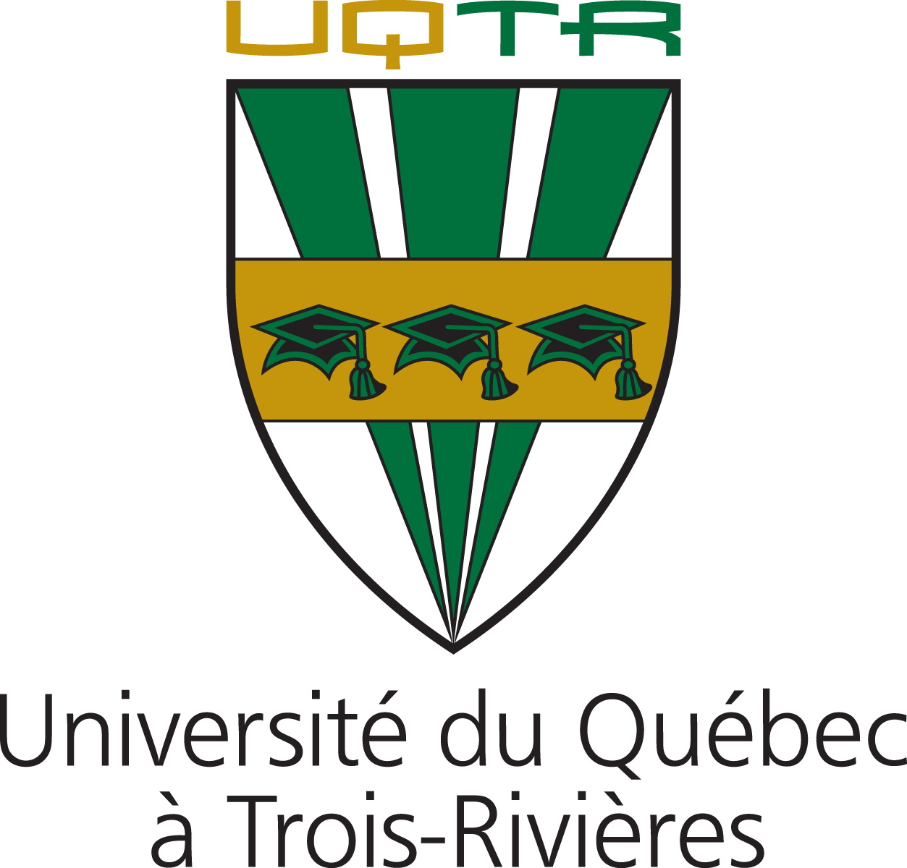
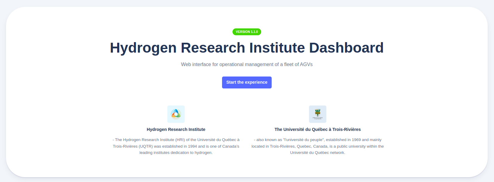
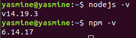
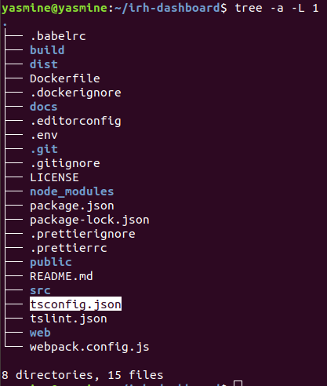
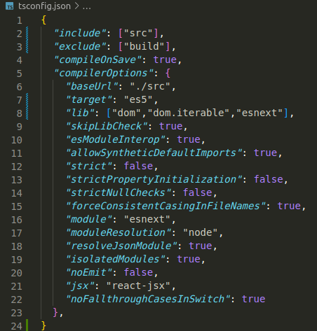
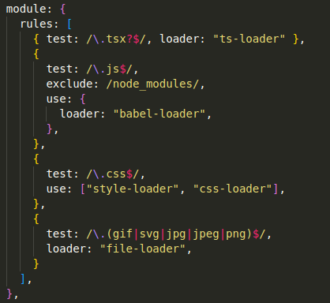
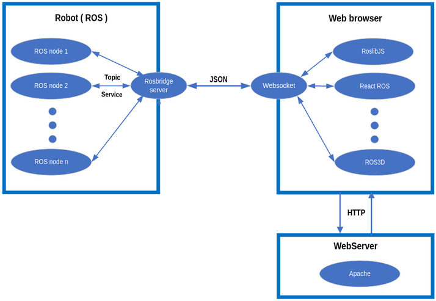
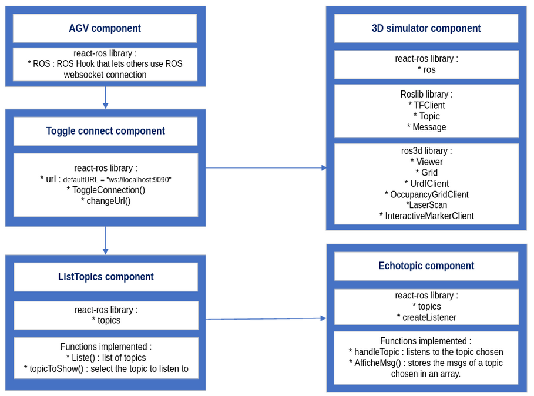

    

<h1 align="center">
    <b>IRH Dashboard</b>
     

</h1>

<h2>Development environment setup</h2>

    components in react let you split the UI into independent, reusable pieces and think about each one independently.

<h3>
    React environment Setup : 
</h3>

	The react package contains only the functionality necessary to define React components. It is typically used together with a React renderer like react-dom for the web.

 - Install NodeJS & NPM: 

To use React Js first of all we have to install NodeJS and NPM which are platforms needed to develop any ReactJS application. 

<ol>
<li>Open the terminal application </li>
<li>Install curl.  RUN :  <code> $sudo apt update && sudo apt install --assume-yes curl</code> </li>
<li>Add PPA for Node.js version 14.x via NodeSource's official PPA setup script.   RUN :  <code> $curl -sL https://deb.nodesource.com/setup_12.x 116 | sudo -E bash -</code></li>
<li>Install latest Node.js. RUN :  <code> $sudo apt-get install -y nodejs</code>  </li>
<li>Check installed nodejs and npm.  
    
</li>
</ol>

 - Install React and React DOM: 

<ol>
<li> Create a root folder with the name of the application on the desktop or where you want.
 </li>
<li> Create a package.json file. To create any module, it is required to generate a package.json file in the project folder. To do this, you need to run the following command..  RUN :  <code> $npm init -y</code> </li>
<li>After creating a package.json file, you need to install react and its DOM packages.   RUN :  <code> $ npm install</code></li>
</ol>

 - Install Webpack: 

Webpack is used for module packaging, development, and production pipeline automation. We will use webpack-dev-server during development, webpack to create production builds, and webpack CLI provides a set of commands. Webpack compiles these into a single file(bundle). To install webpack use the command: 
<code>$ npm install webpack webpack-dev-server webpack-cli --save </code>

 - Install Typescript compiler and loader: 

<code> $ npm install --save-dev typescript ts-loader </code>
<ol>
<li>Modify the directory structure & the configuration files:
 
    

</li>
<li>Set up a configuration to support TSX and compile TypeScript down to ES5   
    
</li>
<li>Configure webpack to handle Typescript, Javascript and images.    
    
</li>
</ol>

 Webpack has 2 different modes. The development mode and the production one.
The development build is used- as the name suggests - for development reasons, you have source maps, debugging possibilities, etc .. 

The production mode on the other hand, runs on production mode which means this is the code running on your client machine. This mode runs uglify and builds the source files into one or multiple minimized files. It can also extract CSS, images and any other sources you’re loading with webpack. The production version of code is very crisp, compact, compressed and uglified for a better user experience and loading on UI.

 

---
<h3> Used Libraries </h3>

<li> RoslibJS  is the core JavaScript library for interacting with ROS from the browser. It uses WebSockets to connect with rosbridge and provides publishing, subscribing, service calls, actionlib, TF, URDF parsing, and other essential ROS functionality. roslibjs is developed as part of the Robot Web Tools effort.
</li>
<li>React ros is a React Component to help connect your Rect website to your robot. This project (React ros) is built using existent work already done by people working on various projects mainly the roslibjs library but also webviz from GM Cruise and jviz from Michael Johnson. We have only tested React-ros with our ROS solution but it is compatible with ROS2 too.
</li>
<li>Ros3D</li>

 

---
<h3>  Environment architecture :  </h3>

	 
    </a>

 The rosbridge server, installed and hosted on the robot environment (ROS environment), acts as a ROS node and communicates with the rest of nodes using topics and services. The rosbridge server translates information received from the robot to JSON files which he sends to the web browser using the websocket protocol. 

 Once we have built our react project using the webpack production mode we deploy all the files generated to the AWS EC2 ubuntu instance already created into the path : /var/www/html.
 

 Make sure apache is installed and start it. RUN : <code> $ service httpd start </code> 

 To verify it’s status. RUN : <code> $ service httpd status </code> 

---

<h3>
    Code summary 
</h3>

	 
    </a>

---

<h2>
    Technical Support
</h2>

    You can send mail to: <a href="yasmine.ben.ameur@uqtr.ca" title="Open Support Ticket">
        yasmine.ben.ameur@uqtr.ca
    </a>

